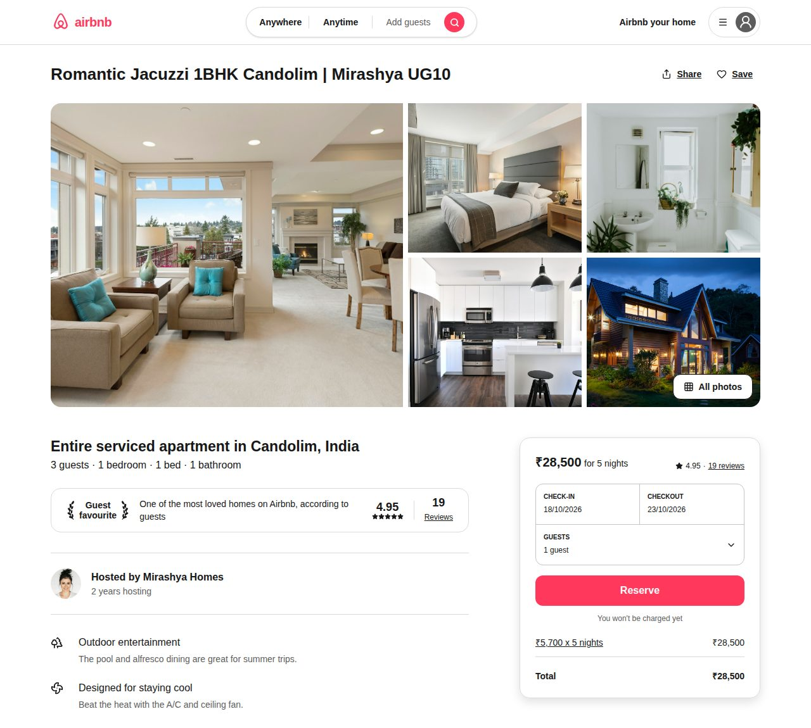
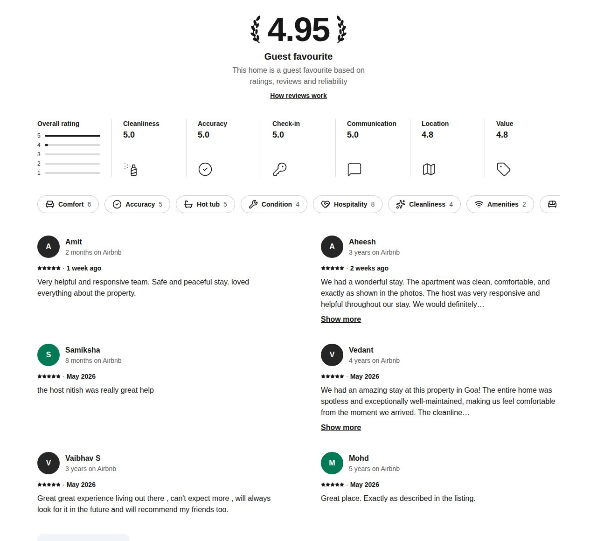
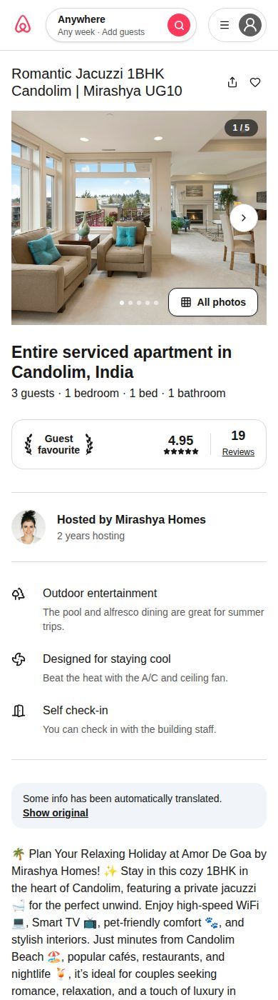

# Staybnb

An Airbnb-style stay listing page for a 1BHK apartment in Candolim, Goa. It has a photo gallery,
a booking card with a date picker, reviews, a location map, the host profile and nearby stays.

Built with **Next.js (App Router)**, **React**, **TypeScript** and **Tailwind CSS**.



## Features

- Photo gallery with a full-screen lightbox (swipe carousel on mobile)
- Booking card with check-in / checkout picker, guest selector and price total
- Inline two-month calendar synced with the booking card
- Sticky section bar (Photos, Amenities, Reviews, Location) with a Reserve button
- Reviews: overall rating, category scores, topic chips and review cards
- Location map (OpenStreetMap), host profile with co-hosts, house rules
- "More stays nearby" carousel
- Responsive layout from phone to desktop, keyboard and screen-reader friendly

| Reviews                                                  | Mobile                                                         |
| -------------------------------------------------------- | -------------------------------------------------------------- |
|  |  |

## Tech stack

| Area            | Tools                                           |
| --------------- | ----------------------------------------------- |
| Framework       | Next.js 16 (App Router), React 19               |
| Language        | TypeScript                                      |
| Styling         | Tailwind CSS 4, shadcn/ui components (Radix UI) |
| Icons and dates | lucide-react, date-fns, react-day-picker        |
| Code quality    | ESLint, Prettier                                |

## Getting started

Requires Node.js 20.9 or newer.

```sh
git clone https://github.com/TusharKalena/staybnb.git
cd staybnb
npm install
npm run dev
```

Open http://localhost:3000.

| Command          | What it does                  |
| ---------------- | ----------------------------- |
| `npm run dev`    | Start the development server  |
| `npm run build`  | Build for production          |
| `npm start`      | Run the production build      |
| `npm run lint`   | Check the code with ESLint    |
| `npm run format` | Format the code with Prettier |

## Project structure

```
staybnb/
├── public/images/          Listing photos
├── docs/screenshots/       Images used in this README
└── src/
    ├── app/                Next.js routes: layout, page, error and 404 pages, global CSS, icon
    ├── components/
    │   ├── booking/        Booking card, date and guest pickers, mobile booking bar
    │   ├── layout/         Header, search bar, profile menu, container
    │   ├── listing/        Page sections: gallery, amenities, reviews, map, host, ...
    │   ├── pages/          ListingPage, which puts all the sections together
    │   └── ui/             Shared shadcn/ui building blocks
    ├── data/               Mock listing data (title, photos, reviews, host, ...)
    ├── hooks/              Booking state and share helpers
    ├── lib/                Formatting and class-name helpers
    └── types/              TypeScript types for the listing data
```

## Notes

All listing data is mock data in `src/data/listing.ts`. Booking happens in the browser only,
so nothing is saved yet.
